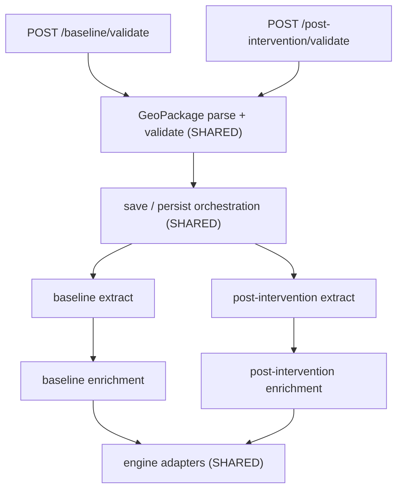

# Code organisation

The backend serves two upload flows — **baseline** and **post-intervention** —
that share most of their machinery. Historically all of it was put under
folders named `baseline/`, including the shared parts and the
post-intervention-only parts. This document records the agreed target layout,
how to decide where a new file goes, and which parts of the tree do not match
the target yet.

## The two flows



Both flows hit the same route factory, the same GeoPackage validator and the
same save/persist orchestration, which dispatch on `projectDocumentKey` /
`documentKey` (`baseline` or `postIntervention`). Only the extract and
enrichment steps genuinely differ.

## Target layout

```
src/validation/
  geopackage/                  SHARED parse + validate pipeline
    baseline/                    baseline extract only
    post-intervention/           post-intervention extract + recompute only
  reference/                   SHARED habitat vocabulary (also serves /reference)
  post-intervention/           post-intervention Joi schema
  project.js, project-shared-schemas.js, index.js

src/services/
  upload/                      SHARED save / persist orchestration
  baseline/                    baseline completeness rules
  post-intervention/           post-intervention completeness rules

src/utilities/
  enrichment/
    shared/                    engine adapters, condition helpers
    baseline/
    post-intervention/
  features/                    downstream consumer, unchanged

src/routes/
  validate-geopackage-route.js SHARED factory
  baseline.js                  baseline validate route only
  post-intervention.js         post-intervention validate route only

src/db/schema/
  baseline-features.js         baseline_* Drizzle tables
  post-intervention-features.js post_intervention_* Drizzle tables
```

## Where does a new file go?

Work down this list and stop at the first match.

1. **Does it parse, validate or describe a GeoPackage, regardless of which flow
   uploaded it?** It is shared GeoPackage plumbing.
2. **Is it habitat vocabulary** (types, distinctiveness, condition bands, the
   template schema)? It is shared reference data.
3. **Does it orchestrate saving an upload** — assigning feature IDs, persisting
   rows, calculating sizes? It is shared upload orchestration, and it dispatches
   on the document key rather than being duplicated per flow.
4. **Does it turn GeoPackage columns into a document, or a document into
   enriched units, for exactly one flow?** It belongs in that flow's folder.
5. **Is it an adapter between our shapes and `bng-metric-engine`'s shapes**
   (condition normalisation, habitat-key candidates, encroachment coercion)? It
   is shared, and belongs in `enrichment/shared/` rather than in either flow's
   enrichment module.

If a file would be used by both flows, put it in the shared home rather than in
one flow's folder. A shared file living under `baseline/` is what created the
confusion this document exists to prevent.

## Naming conventions

- Shared code gets a **domain-precise** name (`geopackage`, `upload`,
  `reference`, `engine-helpers`) rather than a generic `shared`. The exception
  is enrichment, where `enrichment/shared/` sits beside `enrichment/baseline/`
  and `enrichment/post-intervention/`.
- A file named `baseline-*` or `*-post-intervention-*` must be used by that flow
  only. If both flows need it, rename it or split out the shared part.
- Database table names, Liquibase changesets and the JSONB `documentKey` values
  (`baseline`, `postIntervention`) are **not** part of this refactor and stay as
  they are. The same applies to the S3 bucket name `baseline-files` in
  [`src/config.js`](../src/config.js), which is CDP infrastructure.

## Guardrails

There is currently **no** lint rule enforcing these boundaries, so correctness
relies on review. Adding path guardrails
(`no-restricted-imports`, alongside the existing `no-restricted-syntax` rule in
[`eslint.config.js`](../eslint.config.js)) is part of the migration work below.

## Known gaps

The tree does not match the target yet — nothing has moved. Relocating ~109
files at once would make the shared save path, used by both flows,
unreviewable, so the work is sequenced as a series of small changes. Those
changes and their order are in
[`docs/CODE_STRUCTURE_MIGRATION.md`](CODE_STRUCTURE_MIGRATION.md).

Until they are done, treat the following as traps:

- `src/validation/baseline/`, `src/services/baseline/` and
  `src/utilities/baseline/` hold shared and post-intervention code alongside
  baseline code. Check a file's importers before assuming it is baseline-only.
  Most of `src/validation/baseline/` and all of `src/services/baseline/` is
  shared.
- `src/utilities/baseline/enrich-baseline-units.js` is **not** baseline-only:
  the post-intervention enrichment modules import its engine adapters.
- `src/utilities/` imports `HABITAT_STATUS` from `src/services/`, which inverts
  the usual layering. It resolves when the shared services move.
- `src/routes/baseline.js` hosts both validate routes (the shared
  `createValidateGeoPackageRoute` factory is already extracted within it), and
  `src/db/schema/baseline-features.js` holds both table families.
- Several symbols are named for baseline but serve both flows:
  `saveBaselineForProject`, `persistBaseline`, `validateBaselineLayers`,
  `readBaselineGeoPackage`, and `reference/baseline-template.schema.json`.

When moving files, remember that literal paths appear in `vi.mock()` calls, the
coverage `exclude` list in `vitest.config.js`, and the script constants in
`scripts/gen-data-dictionary.js` — a missed path silently disables a mock or a
coverage rule rather than failing.
