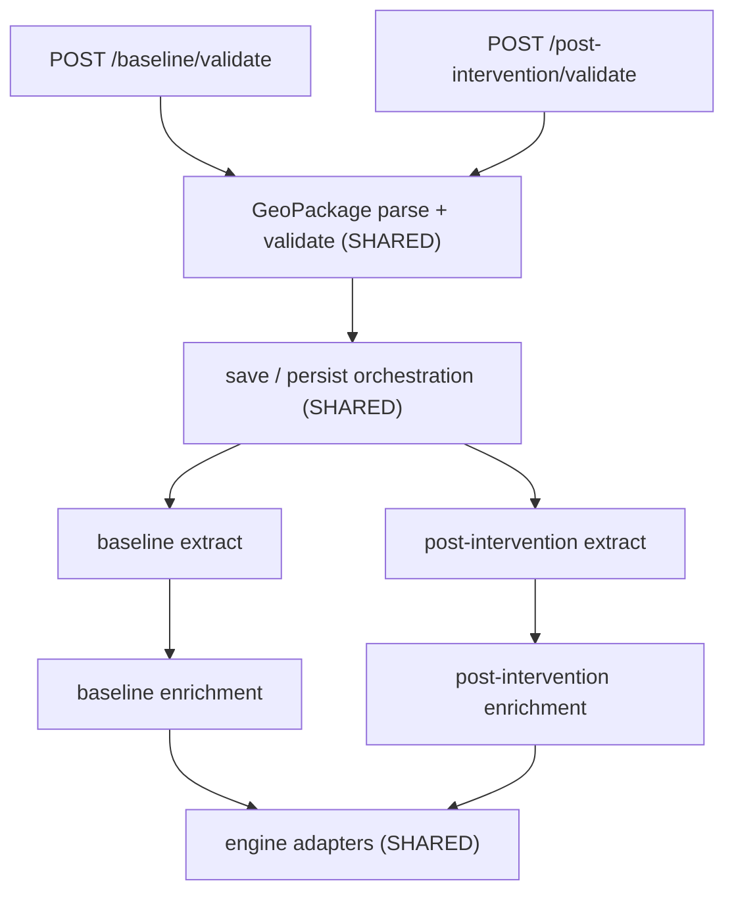

# Code organisation

The backend serves two upload flows — **baseline** and **post-intervention** —
that share most of their machinery. Historically all of it was put under
folders named `baseline/`, including the shared parts and the
post-intervention-only parts. This document records the agreed layout, how to
decide where a new file goes, and the remaining traps after the migration.

## The two flows



Both flows hit the same route factory, the same GeoPackage validator and the
same save/persist orchestration, which dispatch on `projectDocumentKey` /
`documentKey` (`baseline` or `postIntervention`). Only the extract and
enrichment steps genuinely differ.

## Target layout

```
src/validation/
  geopackage/                  SHARED parse + validate pipeline
    baseline/                    baseline extract only
    post-intervention/           post-intervention extract + recompute only
  reference/                   SHARED habitat vocabulary (also serves /reference)
  post-intervention/           post-intervention Joi schema
  project.js, project-shared-schemas.js, index.js

src/services/
  upload/                      SHARED save / persist orchestration
  baseline/                    baseline completeness rules
  post-intervention/           post-intervention completeness rules

src/utilities/
  enrichment/
    shared/                    engine adapters, condition helpers
    baseline/
    post-intervention/
  features/                    downstream consumer, unchanged

src/routes/
  validate-geopackage-route.js SHARED factory
  baseline.js                  baseline validate route only
  post-intervention.js         post-intervention validate route only

src/db/schema/
  baseline-features.js         baseline_* Drizzle tables
  post-intervention-features.js post_intervention_* Drizzle tables
```

## Where does a new file go?

Work down this list and stop at the first match.

1. **Does it parse, validate or describe a GeoPackage, regardless of which flow
   uploaded it?** It is shared GeoPackage plumbing.
2. **Is it habitat vocabulary** (types, distinctiveness, condition bands, the
   template schema)? It is shared reference data.
3. **Does it orchestrate saving an upload** — assigning feature IDs, persisting
   rows, calculating sizes? It is shared upload orchestration, and it dispatches
   on the document key rather than being duplicated per flow.
4. **Does it turn GeoPackage columns into a document, or a document into
   enriched units, for exactly one flow?** It belongs in that flow's folder.
5. **Is it an adapter between our shapes and `bng-metric-engine`'s shapes**
   (condition normalisation, habitat-key candidates, encroachment coercion)? It
   is shared, and belongs in `enrichment/shared/` rather than in either flow's
   enrichment module.

If a file would be used by both flows, put it in the shared home rather than in
one flow's folder. A shared file living under `baseline/` is what created the
confusion this document exists to prevent.

## Naming conventions

- Shared code gets a **domain-precise** name (`geopackage`, `upload`,
  `reference`, `engine-helpers`) rather than a generic `shared`. The exception
  is enrichment, where `enrichment/shared/` sits beside `enrichment/baseline/`
  and `enrichment/post-intervention/`.
- A file named `baseline-*` or `*-post-intervention-*` must be used by that flow
  only. If both flows need it, rename it or split out the shared part.
- Database table names, Liquibase changesets and the JSONB `documentKey` values
  (`baseline`, `postIntervention`) are **not** part of this refactor and stay as
  they are. The same applies to the S3 bucket name `baseline-files` in
  [`src/config.js`](../src/config.js), which is CDP infrastructure.

## Guardrails

Path boundaries are enforced by `no-restricted-imports` in
[`eslint.config.js`](../eslint.config.js) (alongside the existing
`no-restricted-syntax` persist choke-point rule). The import source string is
matched — including deep relative paths and sibling `../baseline/` /
`../post-intervention/` forms inside `enrichment/`.

| Scope                                                                                               | Forbidden imports                                                                                                                                                                           |
| --------------------------------------------------------------------------------------------------- | ------------------------------------------------------------------------------------------------------------------------------------------------------------------------------------------- |
| `enrichment/baseline/**`                                                                            | `enrichment/post-intervention/**` (and `../post-intervention/`)                                                                                                                             |
| `enrichment/post-intervention/**`                                                                   | `enrichment/baseline/**` (and `../baseline/`)                                                                                                                                               |
| `enrichment/shared/**`                                                                              | either flow enrichment folder                                                                                                                                                               |
| Shared pipeline: `validation/geopackage/*.js` (root only) and `routes/validate-geopackage-route.js` | flow enrichment folders and `services/baseline/**` / `services/post-intervention/**` status modules                                                                                         |
| `services/upload/**`                                                                                | `services/baseline/**` / `services/post-intervention/**` and sibling `../baseline/` / `../post-intervention/` (flow enrichment imports remain allowed — upload dispatches on `documentKey`) |
| `geopackage/baseline/**`                                                                            | post-intervention enrichment or status folders                                                                                                                                              |
| `geopackage/post-intervention/**`                                                                   | baseline enrichment or status folders                                                                                                                                                       |

**Still allowed:** flow → `enrichment/shared/`; shared upload → both flow
enrichers; each GeoPackage extract folder → its own status/enrichment modules;
`HABITAT_STATUS` from `services/upload/`.

## Remaining traps

The sequenced migration in
[`docs/CODE_STRUCTURE_MIGRATION.md`](CODE_STRUCTURE_MIGRATION.md) is complete
and the tree matches the target layout above. One layering inversion remains:

- `src/utilities/` still imports `HABITAT_STATUS` from `src/services/upload/`
  (utilities depending on a services constant). The constant no longer lives
  under a baseline-named folder.

When moving files, remember that literal paths appear in `vi.mock()` calls, the
coverage `exclude` list in `vitest.config.js`, and the script constants in
`scripts/gen-data-dictionary.js` — a missed path silently disables a mock or a
coverage rule rather than failing.
