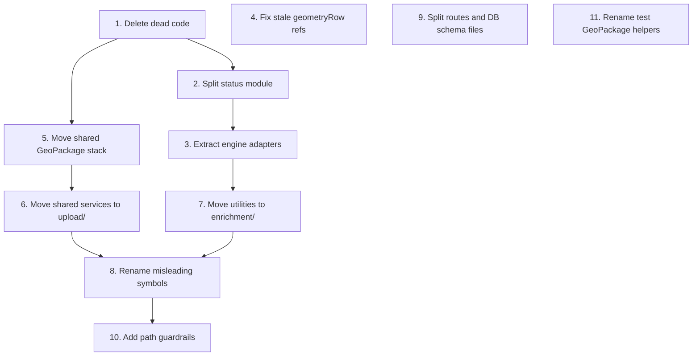

# Migrating to the target code structure

The target layout and the rules behind it are in
[`CODE_STRUCTURE.md`](CODE_STRUCTURE.md). This document is the work list to get
there: one section per ticket, in dependency order.

All eleven tickets below are done. The work was split rather than done as one
large change because of blast radius — historically around 109 files under
`src/` had `baseline` in their path and roughly 120 import lines referenced
those paths, and the shared save/validate pipeline is used by **both** upload
flows, so a mistake breaks baseline uploads as well as post-intervention ones.

**Every ticket must end green**: `npm run lint`, `npm run format:check`,
`npm test`, and `npm run test:integration`. The integration suite matters here
because the shared save path is what these changes touch.

## Order

Tickets 4, 9 and 11 are independent of the rest and can be picked up at any
time. Tickets 1-3 are deliberately first: they are behaviour-preserving splits
with no file moves, so they shrink the later moves without risking the import
graph.

---

## Stage 1 — behaviour-preserving splits (no files move)

### 1. Delete the dead habitat-condition reference module — DONE

**Size:** XS

`src/validation/reference/habitat-condition.js` exports
`getConditionScore`, which has no production importers — only its own test
references it. The engine's `CONDITION_SCORES` is consumed directly elsewhere.

Delete the module and `reference/habitat-condition.test.js`, and check
`src/validation/reference/README.md` does not describe it.

**Done when:** both files are gone and the suite is green.

### 2. Split the habitat status module by flow — DONE

**Size:** S

`src/services/baseline/calculate-habitat-statuses.js` (92 lines) mixes three
concerns: a shared constant, the baseline completeness rules, and the
post-intervention completeness rules. Split it in place, so this ticket has no
cross-directory churn:

| New file                                  | Contents                                                                                            |
| ----------------------------------------- | --------------------------------------------------------------------------------------------------- |
| `habitat-status.js`                       | `HABITAT_STATUS`                                                                                    |
| `calculate-baseline-statuses.js`          | `areaStatus`, `hedgerowStatus`, `watercourseStatus`                                                 |
| `calculate-post-intervention-statuses.js` | `postInterventionAreaStatus`, `postInterventionHedgerowStatus`, `postInterventionWatercourseStatus` |

Do **not** leave a re-export facade behind — it would preserve the ambiguity
this ticket exists to remove.

**Also update:** the seven importers — `extract-habitat-data.js`,
`extract-post-intervention.js`, `extract-post-intervention-trees.js` and
`recompute-post-intervention-area-habitat.js` under `src/validation/geopackage/`,
plus `enrich-baseline-units.js`, `enrich-post-intervention-shared.js` and
`enrich-post-intervention-hedgerow.js` (which re-exports `HABITAT_STATUS`) under
`src/utilities/baseline/`. Split `calculate-habitat-statuses.test.js` to match.

**Watch for:** the `doc.proposed ?? {}` fallbacks in the post-intervention
functions are currently uncovered branches. Add cases for them, or SonarCloud
will report them as uncovered new code once the lines move.

### 3. Extract the shared engine adapters out of baseline enrichment — DONE

**Size:** M

`src/utilities/enrichment/baseline/enrich-baseline-units.js` (346 lines) is named baseline
but is shared: three post-intervention modules import four of its five exports.
Move `normalizeConditionForEngine`, `engineHabitatTypeCandidates`,
`calculateAreaHabitatWithCandidates` and `resolvedWatercourseEncroachments` —
together with their private helpers `coerceEncroachmentForBaseline`,
`formatUnrecognisedEncroachmentValue` and the log prefix — into a new
`engine-helpers.js` in the same folder. That leaves
`enrichBaselineDocumentWithUnits` genuinely baseline-only.

**Also update:** `enrich-post-intervention-area-habitat.js`,
`enrich-post-intervention-hedgerow.js` and
`enrich-post-intervention-watercourse.js`. Retarget the
`vi.spyOn(enrichBaselineUnits, 'calculateAreaHabitatWithCandidates')` call in
`enrich-post-intervention-units.totals.test.js` at the new module, or the spy
silently stops taking effect. The `vi.mock()` factories stubbing
`enrich-baseline-units.js` in `src/routes/baseline.test.js` and
`save-baseline-for-project.test.js` only stub
`enrichBaselineDocumentWithUnits`, so they keep working.

**Opportunity:** `enrich-baseline-units.test.js` is 792 lines, over the 500-line
convention. Moving the adapter tests into `engine-helpers.test.js` is not enough
on its own; splitting the hedgerow and watercourse cases into a second file gets
every file under the limit, and each file then only needs to mock the engine
functions it uses.

**Add at the same time:** a narrow `no-restricted-imports` rule for
`src/utilities/baseline/enrich-post-intervention-*.js` banning imports of
`enrich-baseline-units.js`, so the boundary cannot regress before the folder
move lands. Verify the rule actually fires — a `no-restricted-imports` pattern
that matches nothing fails silently.

### 4. Fix the stale geometryRow references (independent) — DONE

**Size:** XS

`src/validation/project-post-intervention-schema.js` documents the
post-intervention habitats, hedgerows and watercourses as joining to
`bng.baseline_habitats`, `bng.baseline_hedgerows` and
`bng.baseline_watercourses`. They join to the `bng.post_intervention_*` tables,
which all exist in `src/db/schema/baseline-features.js`. Trees are already
correct.

These strings feed Joi `.description()` text, so run `npm run data-dictionary`
and commit the regenerated `data-dictionary/data-dictionary.{md,json}`.

**Watch for:** the Markdown diff is large — the generated table re-pads its
columns when the longest cell changes — but only three descriptions change
semantically. A CI step fails the PR if the committed docs drift, and merging
triggers the Confluence mirror.

---

## Stage 2 — move files into their target homes

Use `git mv` so history follows the file.

### 5. Move the shared GeoPackage stack and reference data — DONE

**Size:** L — the biggest ticket

Landed on branch BMD-926. Shared parse/validate (+ `postgis/`) →
`src/validation/geopackage/`; `reference/` → `src/validation/reference/`;
baseline extract → `geopackage/baseline/`; PI extract/recompute →
`geopackage/post-intervention/`; PI Joi schema →
`src/validation/post-intervention/`.

Prior to the move, `src/validation/baseline/` held roughly 31 production files
(after ticket 1 deleted the dead habitat-condition module). Re-verify was done
by importers before moving.

Target:

- shared parse/validate pipeline → `src/validation/geopackage/`, including the
  `postgis/` subfolder
- `reference/` → `src/validation/reference/` (it also serves the `/reference`
  routes, so it is not GeoPackage-specific)
- `extract-habitat-data.js` → `src/validation/geopackage/baseline/`
- the three post-intervention files → `src/validation/geopackage/post-intervention/`
- `src/validation/project-post-intervention-schema.js` →
  `src/validation/post-intervention/`

**Also update — these are the ones that fail silently:**

- the coverage `exclude` entry for
  `src/validation/geopackage/geopackage-internals.js` in `vitest.config.js`
- `TEMPLATE_REF` and `PROP_KEYS_REF` in `scripts/gen-data-dictionary.js`, plus
  the prose reference to `src/validation/reference/*` in the same file
- the `src/validation/geopackage/carry-forward-feature-ids.js` documentation link
  in `scripts/warehouse-erd-render.js`, then regenerate `docs/warehouse-erd.md`
- `vi.mock()` literal paths in `src/routes/baseline.test.js`,
  `src/routes/baseline.persistence-errors.test.js` and
  `src/services/upload/save-baseline-for-project.test.js`
- the test GeoPackage helpers under `test/helpers/` (later renamed to
  `gpkg*.js` in ticket 11), which import `geopackage-constants.js`, `errors.js`
  and `geopackage-internals-sqlite.js`
- `integration-tests/postgis-validate-baseline-layers.test.js`
- the paths quoted in `CODE_STRUCTURE.md` and this document

**Consider:** landing this as two PRs — `reference/` first (it has few
importers), then the pipeline.

### 6. Move the shared services into upload/ — DONE

**Size:** M

Landed on branch BMD-927. Shared save/persist/size/status-constant code →
`src/services/upload/`; baseline completeness rules stay in
`src/services/baseline/`; post-intervention completeness rules →
`src/services/post-intervention/`. Symbol renames deferred to ticket 8.

Everything in `src/services/baseline/` was shared; `save-baseline-for-project.js`
and `persist-baseline.js` already dispatch on `projectDocumentKey`. Moved
`save-baseline-for-project.js`, `persist-baseline.js`, `calculate-habitat-sizes.js`
and the `habitat-status.js` created by ticket 2 into `src/services/upload/`.
Left `calculate-baseline-statuses.js` in `src/services/baseline/` and moved
`calculate-post-intervention-statuses.js` to `src/services/post-intervention/`.

This also resolves the layering inversion where `src/utilities/` imported
`HABITAT_STATUS` from a baseline-named services folder (utilities still import
from `services/upload/`; a fuller layering fix can wait).

**Depends on:** ticket 2.

### 7. Move the enrichment utilities — DONE

**Size:** M

Landed on branch BMD-928. Moved `src/utilities/baseline/` into
`src/utilities/enrichment/{shared,baseline,post-intervention}/`:

- **shared:** `enrich-units-shared.js`, the `engine-helpers.js` from ticket 3,
  `condition.js`, `is-present-engine-string.js`,
  `proposed-enrichment-fields.js`
- **baseline:** `enrich-baseline-units.js`
- **post-intervention:** `enrich-post-intervention-units.js`, `-area-habitat.js`,
  `-hedgerow.js`, `-watercourse.js`, `-shared.js`,
  `retention-category.js`, `proposed-time-difficulty-display.js`,
  `copy-retained-proposed-from-baseline.js`

**Decision — `baseline-linear-length-by-ref.js`:** classified as
post-intervention support and renamed to
`enrichment/post-intervention/linear-baseline-length-by-ref.js`. It builds a
baseline-length lookup used only by Enhanced linear PI enrichment,
and save orchestration for the PI path — not by baseline enrichment — so it is
not shared. Export names (`buildBaselineLinearLengthByRef`, etc.) were left as
they are — they describe baseline lengths consumed by the PI path, and were
not part of the ticket 8 rename table.

**Also updated:** the ticket 3 ESLint `files` glob to
`src/utilities/enrichment/post-intervention/enrich-post-intervention-*.js`, and
fixture/importer paths (including
`enrich-post-intervention-units.fixtures.js` consumers).

**Depends on:** ticket 3.

---

## Stage 3 — naming, remaining splits, guardrails

### 8. Rename the misleading shared symbols — DONE

**Size:** M, but purely mechanical

Landed on branch BMD-929 as five isolated commits (one per symbol). Also renamed
the PostGIS helper `validateBaselineLayersPostgis` →
`validateGeoPackageLayersPostgis` alongside `validateGeoPackageLayers`, and
aligned module filenames (`save-upload-for-project.js`, `persist-upload.js`,
`read-geopackage.test.js`).

| Current                         | Target                      |
| ------------------------------- | --------------------------- |
| `saveBaselineForProject`        | `saveUploadForProject`      |
| `persistBaseline`               | `persistUpload`             |
| `validateBaselineLayers`        | `validateGeoPackageLayers`  |
| `readBaselineGeoPackage`        | `readGeoPackage`            |
| `baseline-template.schema.json` | `gpkg-template.schema.json` |

**Do not rename:** Postgres table names, Liquibase changesets, or the JSONB
`documentKey` values `baseline` / `postIntervention` — those are persisted data.
Also leave the S3 bucket default `baseline-files` in `src/config.js`: renaming
the string without a coordinated CDP bucket migration breaks uploads at runtime.

### 9. Split the routes and DB schema files (independent) — DONE

**Size:** S

Landed on branch BMD-930. Shared `createValidateGeoPackageRoute` factory →
`src/routes/validate-geopackage-route.js`; baseline validate →
`src/routes/baseline.js`; post-intervention validate →
`src/routes/post-intervention.js`. HTTP paths unchanged.

`post_intervention_*` Drizzle tables →
`src/db/schema/post-intervention-features.js`; `baseline_*` stay in
`baseline-features.js`. Import-only reorganisation — **no migration**, table
names unchanged. `src/plugins/router.js` imports both route modules;
`integration-tests/route-manifest.json` unchanged (paths unchanged).

### 10. Add the path guardrails — DONE

**Size:** S

Landed on branch BMD-931. Replaced the narrow ticket-3
`enrich-post-intervention-*.js` → `enrich-baseline-units.js` rule with
folder-scoped `no-restricted-imports` regex patterns in `eslint.config.js`:

- `enrichment/baseline` ↔ `enrichment/post-intervention` cross-imports
- `enrichment/shared` must not import either flow enrichment folder
- shared pipeline (`validation/geopackage/*.js`,
  `routes/validate-geopackage-route.js`) must not import flow enrichment or
  status folders
- `services/upload/**` must not import flow status folders (flow enrichment
  remains allowed for documentKey dispatch)
- each GeoPackage extract folder must not import the other flow's enrichment
  or status modules

Documented under Guardrails in `CODE_STRUCTURE.md`. Each rule was verified with
a temporary offending import before landing.

**Depends on:** tickets 7 and 8.

### 11. Rename the test GeoPackage helpers (optional, cosmetic) — DONE

**Size:** XS

Landed on branch BMD-932. Renamed the seven `test/helpers/baseline-geopackage*.js`
modules (barrel + build + db split) to a neutral `gpkg*` / `gpkg-*` prefix:

| From                           | To              |
| ------------------------------ | --------------- |
| `baseline-geopackage.js`       | `gpkg.js`       |
| `baseline-geopackage-build.js` | `gpkg-build.js` |
| `baseline-geopackage-db.js`    | `gpkg-db.js`    |
| `baseline-geopackage-db-*.js`  | `gpkg-db-*.js`  |

Importers in `src/validation/geopackage/*.test.js` updated. Purely cosmetic —
no behaviour change.
